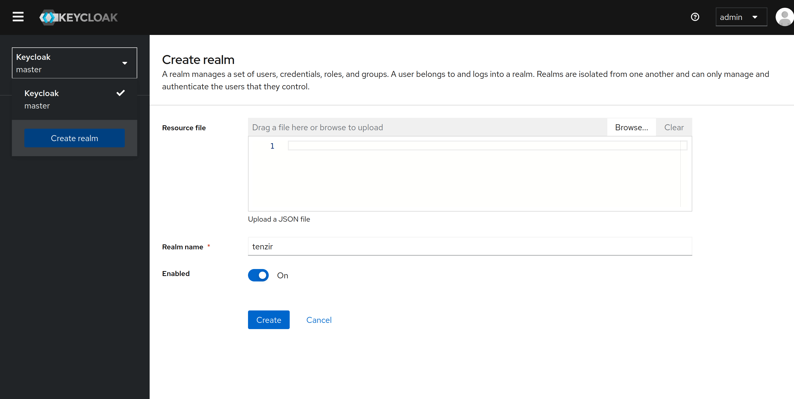
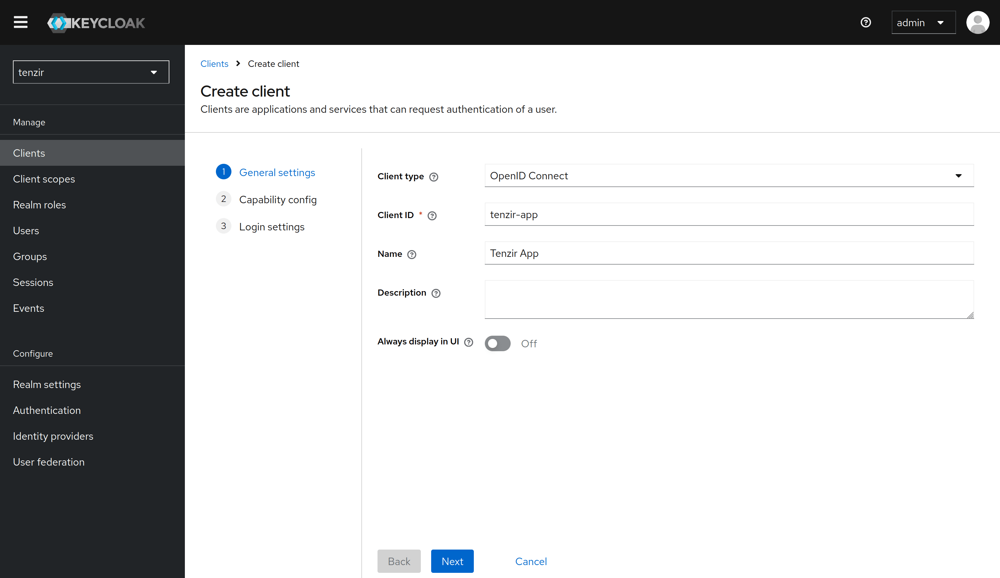
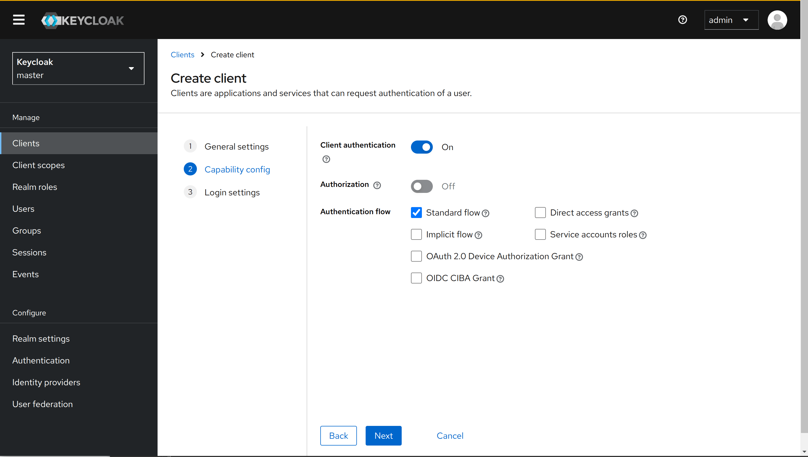
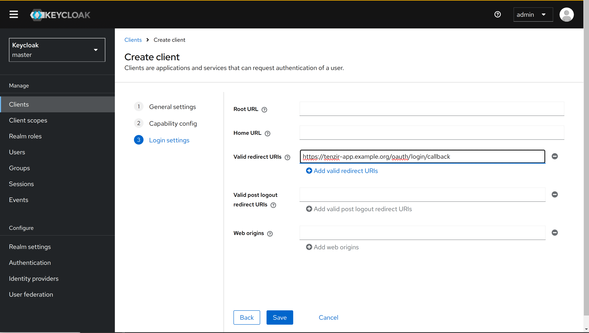
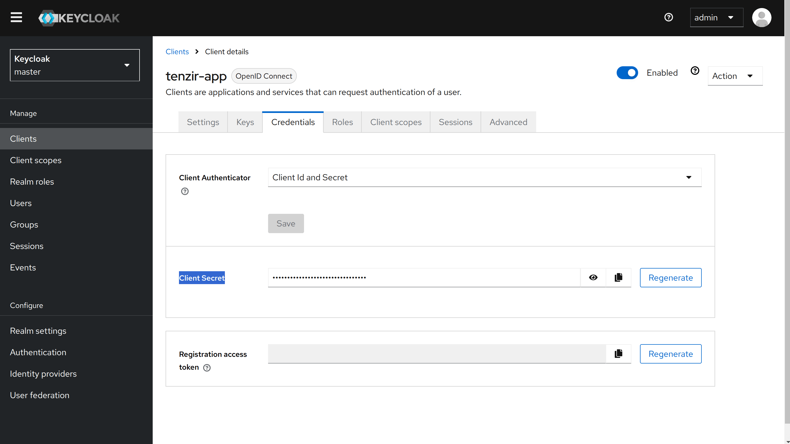
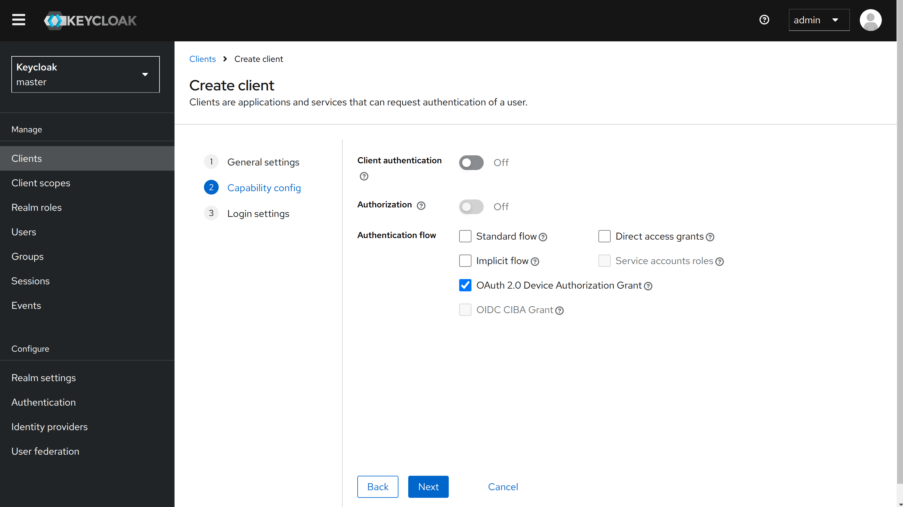

# Keycloak Setup Guide

In order to use the Tenzir Platform with a Keycloak instance
as Identity Provider, it is necessary to do some additional
manual configuration.

This document is intended to guide you through this process.
You can also view an [online version](docs.tenzir.com/...).

We assume that you already have a Keycloak instance up
and running that is reachable with a browser, for example
by running the `keycloak` service from the Docker Compose file
in this example. The same configuration steps apply when using
an external Keycloak instance.

## Setting up the Keycloak Instance

### Admin Login

Navigate to the Keycloak instance and log in as a user with admin permissions.
If you use the bundled Keycloak instance, the initial username is `admin`
and password is `changeme`.

Remember to change the default password after logging in for the first time,
and to set up 2-factor authentication for your admin user.

### Create a new `tenzir` realm (optional)

Keycloak defaults to the `master` realm and the bundled Docker Compose
stack is configured to use this realm.

If you want to use a different realm, or already have an existing one,
update the `TENZIR_PLATFORM_OIDC_ISSUER_URL` variable to point to the
new realm instead.

### Create a Client for the App

Use the `Add Client` button in the `Clients` menu on the left. The new
client should be configured as follows:

Under "General settings", set the client type to "OpenID Connect" and the
client id to `tenzir-app`. If you use a different client id,
remember to update the `TENZIR_PLATFORM_OIDC_PROVIDER_CLIENT_ID` variable
in your [Tenzir Platform config](https://docs.tenzir.com/installation/deploy-the-platform#configure-the-platform)
config accordingly.

Under "Capability config", enable client authentication and the "Standard flow"
access method.

Under "Login settings", enter a redirect URL that points to `${TENZIR_PLATFORM_DOMAIN}/login/oauth/callback`, where
`TENZIR_PLATFORM_DOMAIN` is the domain that is configured in your Tenzir Platform configuration.
For example, if the app is running under `https://tenzir-app.example.org` then this should be
`https://tenzir-app.example.org/login/oauth/callback`

Finally, in the client view, go to the Credentials tab and copy the value of
the generated client secret. This must be added to the Tenzir Platform configuration
under `TENZIR_PLATFORM_OIDC_PROVIDER_CLIENT_SECRET`

## Create a Client for the CLI

In order to use the `tenzir-platform` CLI we need to set up an additional
client that supports device code authentication. (It is possible but not
recommended to use the same client for both Frontend and CLI)

In order to do this, proceed exactly as above, but use `tenzir-cli` as
the client id and under "Capability config" disable the "Client authentication"
setting and enable the "OAuth 2.0 Device Authorization Grant" authentication flow.

## Advanced Topics

### Custom Scopes

By default, the Tenzir Platform requests the `profile email openid offline_access` scopes
when logging in. To adjust this, set the `PUBLIC_OIDC_SCOPES` environment variable
to a space-separated list of scope names.

### Profile Pictures

To include custom profile pictures, include a `picture` claim in the returned
ID token containing an URL to the image file.

The Tenzir Platform will read that claim and use it as the profile picture in
the top right corner of user interface, or fall back to a default image if the
claim is not present.

### Refresh Tokens

The Tenzir Platform supports the use of refresh tokens and will by default request
the `offline_access` scope to automatically refresh sessions after the initial
id token has expired. To this end, the `offline_access` scope is requested by
default.

Unfortunately, the OIDC spec is a bit ambiguous on the precise semantics of
the `offline_access` scope, and Keycloak's interpretation is slightly different
from most other OIDC providers: It always includes refresh tokens by default,
and adds additional permissions to the token when the `offline_access` scope
is requested.

Therefore, some organizations forbid the use of tokens with `offline_access`
permissions for security reasons. In that case, add an environment variable
`PUBLIC_OIDC_SCOPES=profile email oidc` to the `app` environment in order to explicitly
remove the scope request. The bundled Docker Compose file in this directory does this
by default.
